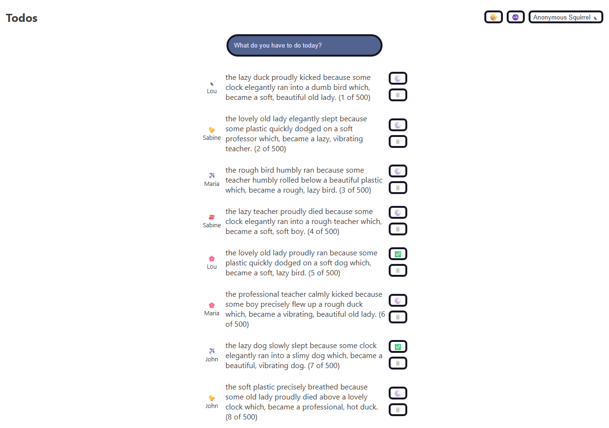

# Optimize This!

> A React todo app deliberately built with common performance pitfalls, then fixed step by step — a Codecademy performance-optimization exercise.



---

## 🧩 Problem / Context

This project started from Codecademy's "Optimize This!" starter code: a small todo app that renders 500 items and is, on purpose, full of classic React performance mistakes (unmemoized callbacks, unnecessary re-renders, an eagerly-loaded bundle). The goal was to profile the app, find the bottlenecks, and fix them one commit at a time without changing behavior.

---

## 🛠️ Stack

| Layer           | Technology                    |
|------------------|--------------------------------|
| Frontend         | React 18, Create React App (react-scripts 5) |
| State management | React Context + `useReducer`  |
| Testing          | React Testing Library, Jest    |
| Package manager  | pnpm                           |

---

## 🏗️ Architecture

- `Todos` owns the list state via `useReducer` (`add` / `update` / `delete`), while `ProfileProvider` and `PartyProvider` expose the current user and the "animations enabled" flag through Context.
- `TodoItem` is the item renderer for a 500-row list, so it's the component most sensitive to re-renders.
- `Confetti` (celebration animation) and the profile's icon picker are split out of the main bundle and loaded on demand.

---

## 🧠 Technical challenges & decisions

- **Problem:** every keystroke in the "new todo" input re-rendered all 500 `TodoItem` rows. → **Solution:** wrapped `TodoItem` in `React.memo` and moved `formatTodoText` into a `useCallback` with a stable reference. → **Why:** `React.memo` only pays off if the props it receives are referentially stable; an inline function prop would have defeated it.
- **Problem:** the username validity check in `Profile` re-ran on every render, even when the username hadn't changed. → **Solution:** derived `isUsernameValid` with `useMemo` keyed on `username`. → **Why:** the check is pure and only needs to run when its input changes.
- **Problem:** the confetti animation and the profile icon list were bundled into the initial JS payload even though most users never open them. → **Solution:** loaded `Confetti` via `React.lazy` + `Suspense`, and the icon options via a dynamic `import()` inside a `useEffect`. → **Why:** code-splitting rarely-used, non-critical UI keeps the initial bundle smaller and the first render faster.
- **Problem:** todo list updates involved several related pieces of state (add/update/delete) that are easy to get out of sync with separate `useState` calls. → **Solution:** consolidated them into a single `useReducer`. → **Why:** a reducer keeps the transitions explicit and testable, and pairs naturally with `React.memo`'s reliance on stable `dispatch`.

---

## 🚀 How to run it

```bash
git clone https://github.com/Carlou134/optimize-this-react-codeacademy.git
cd optimize-this-react-codeacademy
pnpm install
pnpm start
```

Other available scripts: `pnpm test` and `pnpm build`.
